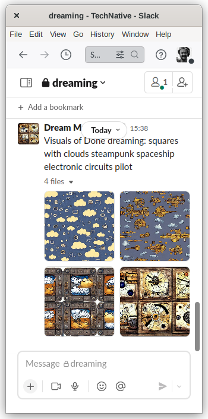

# Slack Dreams

(Optimized) Stable Diffusion Bot developed for TechNative's Slack Channels.

## Usage

- Clone somewhere on the same machine with stable diffussion.
- Change directory to stable-diffussion
- Active Stable Diffussion Conda
- Maybe `pip install slack_sdk and slack_bolt`
- run `python ../../path/to/slackdreams/slackdreams.py`

## Credits

- Glued to Slack by [Pim Snel](https://github.com/mipmip)
- Also see [Teledream](https://github.com/mipmip/teledream)
- For her wunderful blog [Christine Dodrill](https://xeiaso.net/blog/stable-diffusion-nixos)
- TechNative, Most fun startup in The Netherlands 
